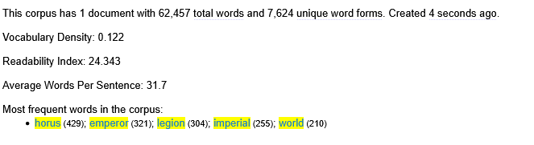
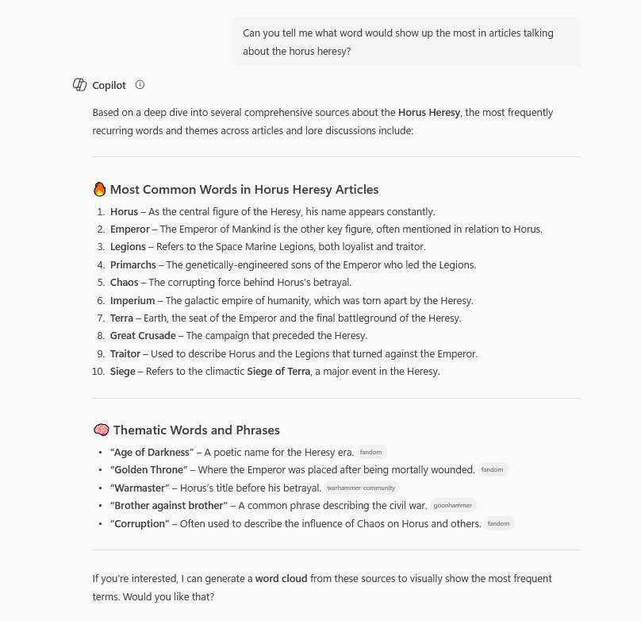
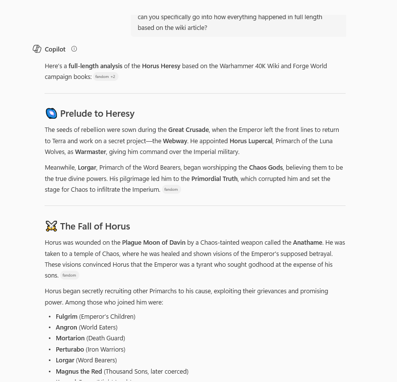



# Distant Reading Assignment 

I used Voyant to analyze this website. [Warhammer 40k Wiki](https://warhammer40k.fandom.com/wiki/Horus_Heresy)

Using the Voyant website taught me just how many viewpoints of data can come from just viewing a website as some of what I was looking at could be seen in one of my math textbooks! There were graphs and numbers in some of the categories that popped up and went into some detail about words and phrases that were said the most throughout the entire website. To my knowledge, I don't think I have used a tool such as Voyant before and seeing how many things it could get just from a url link blew my mind.

Here's an image showing the structure of the words used in the article:

After Voyant, I ended up using CoPilot so analyze the same website. There were definitely some major differences between the two tools as Voyant was more data driven while CoPilot went more in depth about the topic of the article itself. I think using CoPilot would be easier in answering narratiive based questions rather than data as the data questions I asked did not go as far as Voyant.

Here is an image talking to CoPilot for a data driven answer comparing it to Voyant:

Here is another image with CoPilot asking it to tell me the plot in detail, or as much as I could fit in the image:

After using both these tools, Voyant and CoPilot in my research feel as they are used for different things. Voyant since it is more data driven, it can tell you a lot from a numbers point of view but if you're looking for more of a plot synopsis then I don't think it can tell you a whole lot of information about what you're reading but it can tell you a lot about key words and the major vocabulary used. CoPilot can tell you a lot more about the topic since it is question based rather than data and therefore can fill you in on a broader spectrum of data. The downside I see to CoPilot is that what it gives us isn't the most detailed in explaining it as even when you ask for a detailed analysis, it still gives you bullet points and cliffnotes so finding out the everything in the article won't be that easy with CoPilot. Using these tools taught me that there are different approaches when researching an article and even in ways I haven't thought of before, now I know of two avenues where I can get some more help if I am ever in a roadblock or if I need to compare and contrast different works. 

